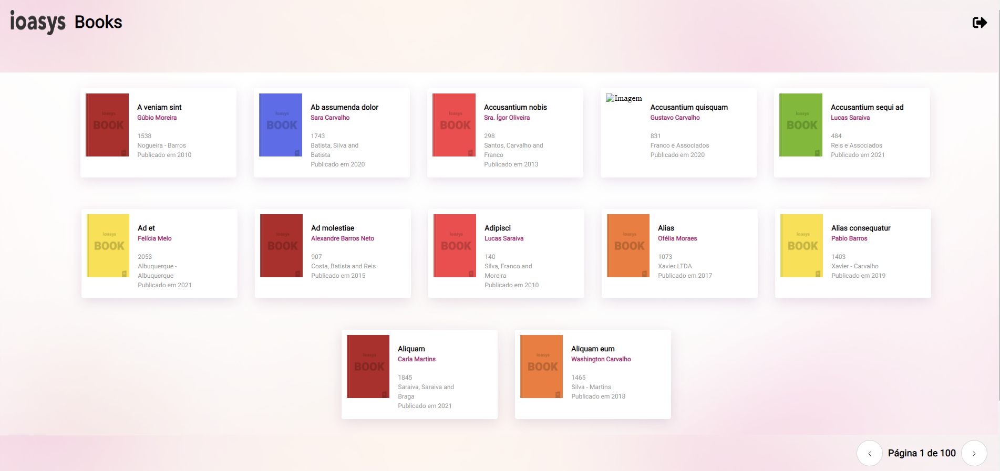
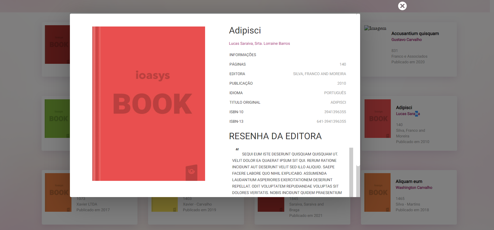
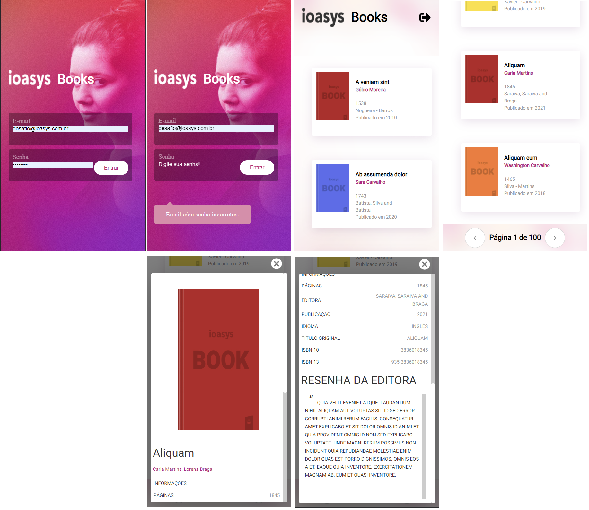

# Teste técnico da IOASYS

# Sobre

Estes documento README tem como objetivo fornecer as informações necessárias para realização do projeto **ioasys books**.

# O que fazer?

- Você deve criar seu projeto e subir em um repositório e ao finalizar, enviar o link do seu repositório para a nossa equipe. Lembre-se, NÃO é necessário criar um Pull Request para isso, nós iremos avaliar e retornar por email o resultado do seu teste.

# Requisitos

- Seu projeto deverá ser construído utilizando **ReactJS** ou **Angular**.
- Seu projeto deverá ser construído utilizando o layout disponibilizado na descrição do teste.
- A integração com a API deve ser feita respeitando todos os contratos de OAuth.

# Itens a serem avaliados
<ol>
<li>Estrutura do Projeto</li>
<li>Boas práticas da Linguagem/Framework</li>
<li>Integração com API</li>
<li>Bibliotecas utilizadas</li>
<li>Estilização dos componentes</li>
<li>Persistência de login</li>
<li>Layout responsivo</li>
<li>Friendly URL</li>
<li>Seu projeto deverá seguir tudo o que foi exigido na seção O que desenvolver?desenvolver?**
</li>

</ol>

# Extra

Esses itens não obrigatórios, porém desejados.
<ol>
    <li>Testes unitários</li>
    <li>SEO</li>
    <li>Linter</li>
    <li>Code Formater</li>
    <li>Documentação de componente</li>
</ol>

# O que desenvolver?

Você deverá construir um projeto utilizando o layout proposto
<ol>
<li>Login e acesso de Usuário já registrado</li>
<li>Para ter acesso as demais APIs precisamos enviar o authorization no header para autorizar a requisição;
</li>
<li>Listagem de Livros</li>
<li>Detalhamento do Livro</li>

</ol>

## Layout

<h2>Telas para desktops</h3>

<h2>Telas para celular</h3>

# Documentação de componentes

<ol>
<li>
    <h3>Animete</h3>
    
É apenas um aruivo json, para ajudar a componenete Loade criar uma animação de carregamento.

</li>
<li>
    <h3>Card</h3>
    
Esta componente recebe os seguintes valores:

    <ol>
        <li>authors: autor do livro</li>
        <li>imageUrl: link da imagem do livro</li>
        <li>pageCount: quantidade de páginas do livro</li>
        <li>published: data da publicação do livro</li>
        <li>publisher: editora do livro</li>
    </ol>
</li>
</li>
<li>
    <h3>FormSigin</h3>
    
Ela é responsável pelo login do usuário, onde o mesmo entra com e-mail e senha e assim é feito a autenticação do usuário e permitido o login.

</li>
<li>
    <h3>Header</h3>
    
Mostra a logo do site e a opção de sair do site.
    Não recebe nenhum parâmetro.
    

</li>
<li>
    <h3>Loade</h3>
    
Cria uma animação de carregamento. Não recebe nenhum parâmetro.
    

</li>
<li>
    <h3>Modal</h3>
    
Recebe o parâmetro id do livro e mostra os detalhes do mesmo.
    

</li>
</ol>

# Comando para instalar as dependências

            yarn

# Comandos para executar a aplicação

            yarn dev
